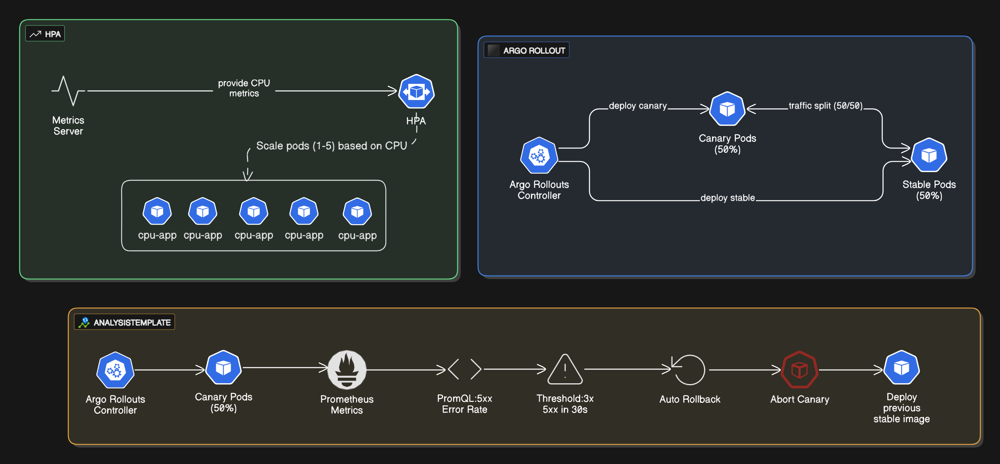
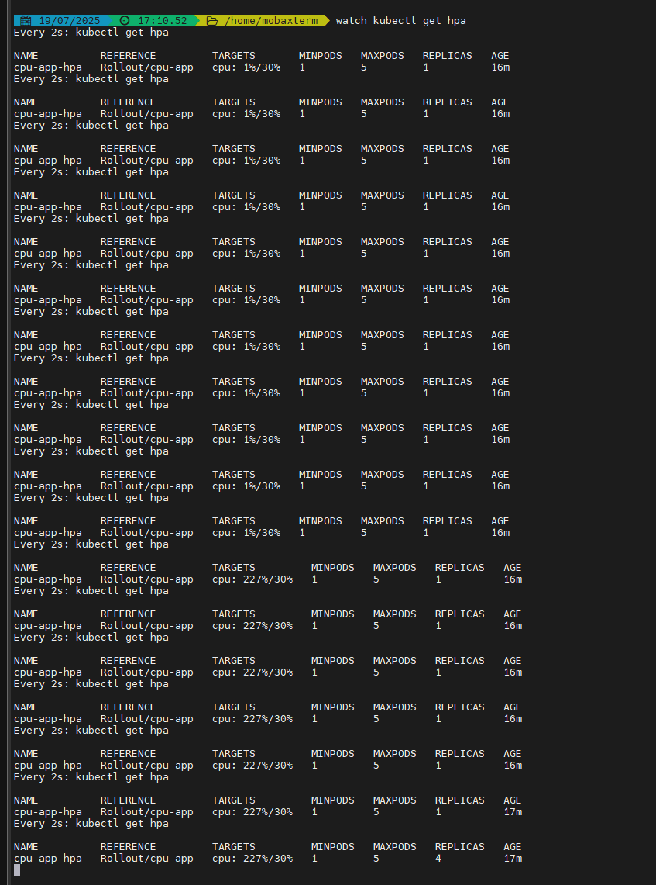
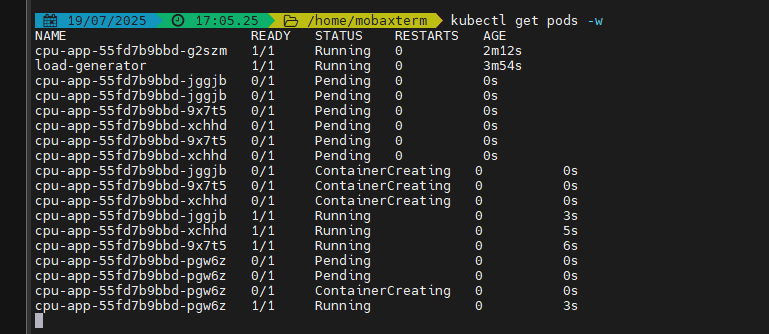
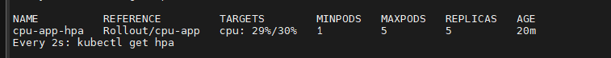
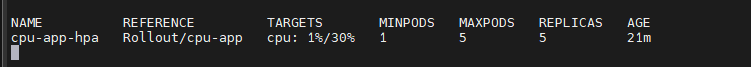
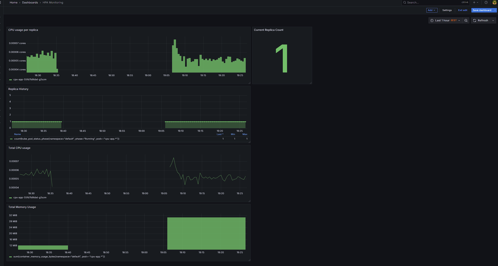
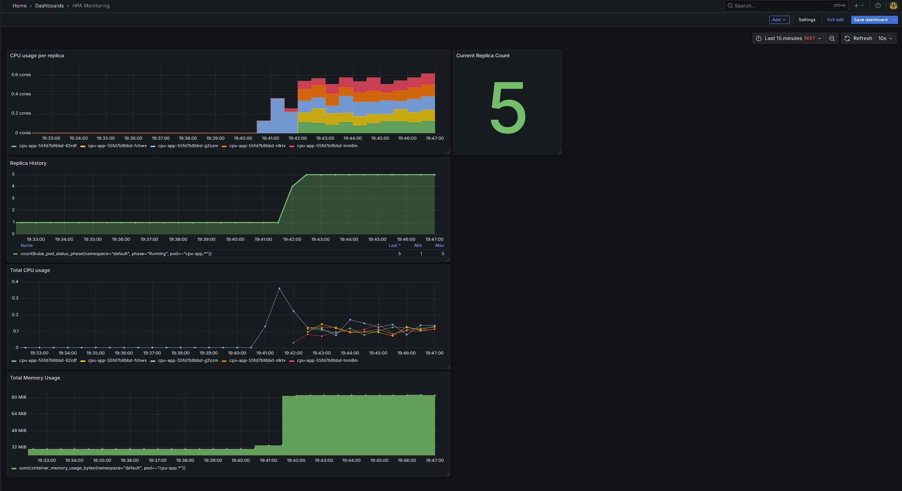

# Horizontal Pod Autoscaler (HPA) with Argo Rollouts in Kubernetes

## The problem

Modern cloud-native applications must scale efficiently and deploy safely. In production, it's not enough to simply handle traffic bursts — we also need to roll out new versions with confidence, minimizing risk.

Problem 1: How do we scale application pods automatically based on CPU load?

Problem 2: How do we deploy a new version safely with observability into the progress and ability to pause or rollback?

## The solution

Integrate Horizontal Pod Autoscaler (HPA) to scale the app based on CPU usage.

Argo Rollouts to replace standard Deployments and provide canary-style deployment with pause/set-weight logic.

Prometheus + Grafana stack for real-time monitoring.

This project simulates real-world production behavior by generating artificial load to trigger HPA and visualizing both scaling and rollout events.

## Tech Stack

- Kubernetes (Minikube)
- Argo Rollouts
- Horizontal Pod Autoscaler (HPA)
- Prometheus
- Grafana

## Features

- Automatically scaled app pods from 1 to 5 replicas under CPU stress.
- Canary deployment performed with Argo Rollouts (50/50 weight + pause, then proceed).
- Rollback deployment initiated from Argo Rollouts to deploy earlier version.
- Monitoring visualized using custom Grafana dashboards:
  -- CPU usage per replica
  -- Replica history
  -- Total CPU usage
  -- Total memory usage

## Architecture Overview

## Demo Evidence

See [screenshots](docs/assets/)

### HPA Behavior:

- CPU load surpasses 30% target → HPA scales up
  
- Loop output generating load
  
- Pods increased to 5
  
- CPU usage drops and HPA scales down to 1
  
  

### Monitoring with Grafana and Prometheus:

- Before load (screenshot: grafana-before-load.png)
  
- After load spike (screenshot: grafana-after-load.png)
  

### Argo Rollout Canary Deployment:

- Rollout in progress via UI
  

## Explore More in docs/

[hpamd](docs/hpa.md) – Explains HPA setup and test process.

[rolloutmd](docs/rollout.md) – Walkthrough of rollout strategy and CLI usage.

[monitoringmd](docs/monitoring.md) – Details Grafana dashboard setup and queries.
